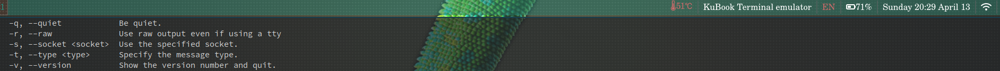

# IPC bar content generator

bar2.bash is an ipc compatible script for rendering essential info in the swaybar.
Everything else is the rest of the configuration to make it usable and my personal preferences in key bindings.

* Container name only on active output
* Keyboard input language
* Battery (if under 80%)
* CPU temperature
* remaining RAM (if under 1 GB)
* Date and time

## Setup

Copy files *bar2.bash, config, for_window, for_output, padlock.png* files into your *~/.config/sway* directory

### Edit variables in header of the bar2.bash script according to your setup

$1 argument may hold the output screen ID (see config file for more info)

    declare -r kbID="1:1:AT_Translated_Set_2_keyboard"
    declare -r power="upower -i /org/freedesktop/UPower/devices/battery_BAT0"
    declare -r tempProbe="/sys/devices/virtual/thermal/thermal_zone7/temp"

the following command may help you choosing the right one

    find /sys/devices/virtual/thermal -name temp -print -exec cat "{}" \;

### Enable ticking service
that raises events, to update the swaybar even if no changes in focus are made.
It's neccessary to prevent having outdated time, temperature, or charge on the bar. By default it fires every 7 seconds.

Copy the *swaybar.service* file into */etc/systemd/user/* directory, give it proper permissions and

    systemct --user enable swaybar.service
    systemct --user start swaybar.service
